# Система учёта сетевой инфраструктуры и расхода материалов (Кабинет 319Б)

Учебный проект по дисциплине «Информационные системы и технологии» курсантов Каспийского института морского и речного транспорта (КИМРТ). Проект представляет собой веб-платформу для ведения учета сетевого оборудования, фиксации неисправностей (дефектов), контроля складских остатков и автоматического формирования отчетности.

---

## 🚀 1. Стек технологий

Проект разработан на базе простого и понятного стека технологий без использования сложных сторонних фреймворков:

- **Бэкенд:** PHP 7.4+ / 8.x (процедурный стиль, безопасное подключение PDO).
- **База данных:** MySQL (подключение через локальный сокет `localhost`).
- **Фронтенд:** HTML5, CSS3, CSS-фреймворк Bootstrap 5.3.3 и библиотека иконок Bootstrap Icons (подключены через внешние ссылки CDN).

---

## 🗄️ 2. Структура базы данных

База данных проекта состоит из 7 связанных между собой таблиц в СУБД MySQL.

### 2.1. Таблица `users` (Пользователи)
Хранит данные учетных записей операторов и администраторов. Пароли хэшируются с помощью функции `password_hash()`.
*   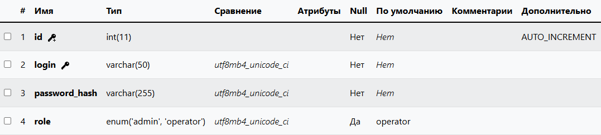

### 2.2. Таблица `locations` (Рабочие места)
Хранит список рабочих мест в Кабинете 319Б (номера компьютеров ПК-01 ... ПК-16, рабочее место преподавателя и серверный шкаф).
*   **Скриншот таблицы в phpMyAdmin:**
    *   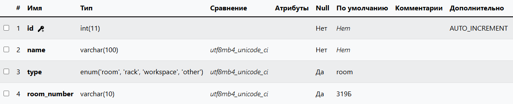

### 2.3. Таблица `network_points` (Точки сети)
Хранит список сетевых розеток, портов, коммутаторов и кабелей, привязанных к конкретным рабочим местам.
*   **Скриншот таблицы в phpMyAdmin:**
    *   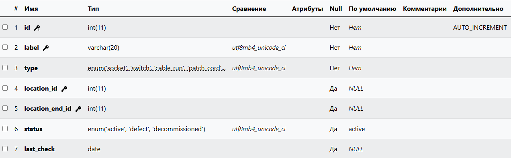

### 2.4. Таблица `defects` (Журнал дефектов)
Содержит записи о зафиксированных поломках сетевого оборудования, включая текстовые описания, пути к фотографиям дефектов и текущие статусы ремонта.
*   **Скриншот таблицы в phpMyAdmin:**
    *   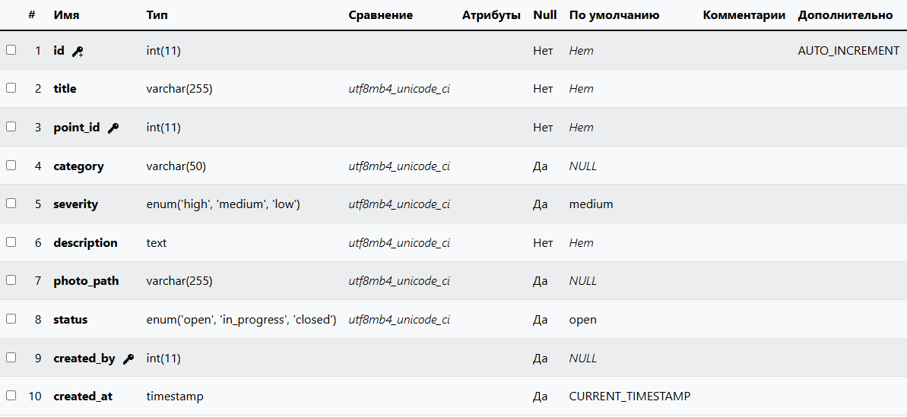

### 2.5. Таблица `materials` (Склад материалов)
Ведет учет остатков расходных материалов на складе (кабели, розетки, коннекторы, крепежи) в метрах или штуках.
*   **Скриншот таблицы в phpMyAdmin:**
    *   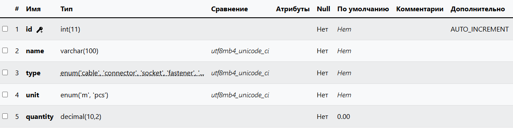

### 2.6. Таблица `material_usage` (Расход материалов)
Журнал списания расходников на проведение конкретных ремонтных работ в кабинете.
*   **Скриншот таблицы в phpMyAdmin:**
    *   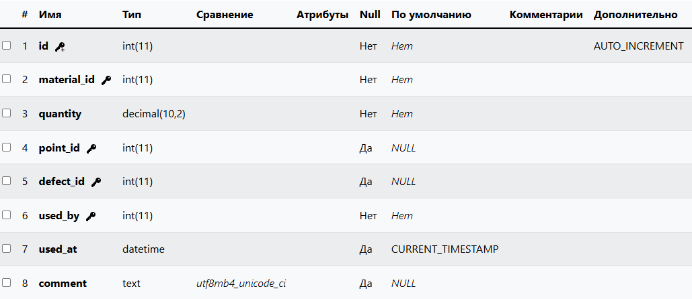

### 2.7. Таблица `logs` (Системный журнал аудита)
Хранит историю действий пользователей (входы в систему, добавление/удаление сетевых точек, проведение ремонтов) для контроля безопасности.
*   **Скриншот таблицы в phpMyAdmin:**
    *   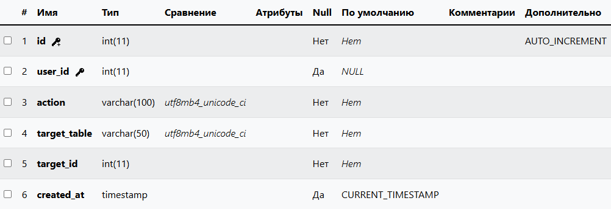

---

## 🏗️ 3. Структура проекта (Архитектура MVC)

Код приложения строго разделен по принципу **Model-View-Controller (MVC)** для чистоты структуры и удобства совместной разработки:

```text
superproject/
│
├── db/                   # Подключение к базе данных
│   └── connectDB.php     # Конфигурация соединения PDO
│
├── models/               # Слой работы с БД (SQL-запросы в виде простых функций)
│   ├── dashboard.model.php
│   ├── defects.model.php
│   ├── inventory.model.php
│   ├── materials.model.php
│   ├── report.model.php
│   ├── statistics.model.php
│   └── logs.model.php
│
├── controllers/          # Бизнес-логика, обработка форм и валидация
│   ├── inventory.controller.php
│   ├── defects.controller.php
│   ├── materials.controller.php
│   ├── report.controller.php
│   ├── statistics.controller.php
│   ├── logs.controller.php
│   ├── login.controller.php
│    register.controller.php
│   └── logout.controller.php
│
├── views/                # Визуальная часть, HTML-шаблоны страниц
│   ├── components/       # Повторяющиеся элементы (header.view.php, footer.view.php)
│   ├── index.view.php    # Главная страница (интерактивные планы)
│   ├── inventory.view.php # Страница оборудования
│   ├── defects.view.php  # Журнал поломок
│   ├── fix_defect.view.php # Списание материалов при починке
│   ├── materials.view.php # Склад материалов
│   ├── report.view.php   # Печать отчетов и экспорт в CSV
│   ├── statistics.view.php # Статистика и графики
│   ├── logs.view.php     # Системные логи
│   ├── login.view.php    # Окно входа
│   └── register.view.php # Окно регистрации
││
├── css/                   # Дополнение к визуалу
│   ├── defects.css   
│   ├── index.css
│   ├── login.css
│   ├── report.css
│   ├── statistic.css
│   └── main.css
│
├── uploads/              # Папка для загружаемых медиафайлов
│   ├── physic.svg        # Физический план кабинета (экспорт из Draw.io)
│   ├── network.svg       # Сетевой план кабинета (экспорт из Draw.io)
│   └── defects/          # Фотографии поломок сетевого оборудования
│
└── index.php             # Главная точка входа в приложение
```


*   **Скриншоты файловой структуры проекта (по папкам):**

    *   **Корень проекта (структура файлов):**

        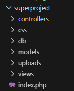

    *   **Папка `db/` (подключение к базе данных):**

        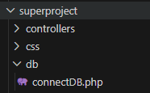

    *   **Папка `models/` (модели работы с БД):**

        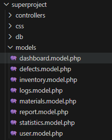

    *   **Папка `controllers/` (контроллеры логики):**

        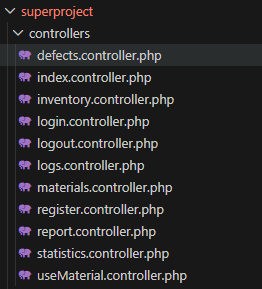

    *   **Папка `views/` (представления и шаблоны):*

        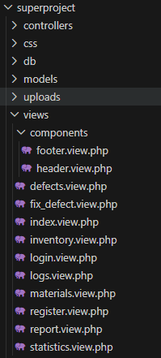

    *   **Папка `uploads/` (хранилище файлов и схем):**

        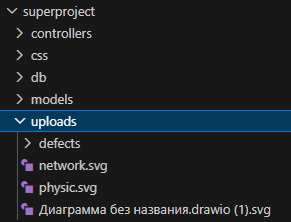

---

## 📘 4. Подробная инструкция по использованию системы

### 4.1. Авторизация и регистрация
*   При первом запуске сайта гость попадает на страницу входа. Если аккаунта еще нет, необходимо перейти во вкладку **Регистрация** в правом верхнем углу меню, ввести логин и дважды ввести пароль (не менее 4 символов).
*   После успешной регистрации система перенаправит вас на страницу **Входа**. Введите логин и пароль.
*   *Ролевая модель:* Если вы вошли под учетной записью с ролью `operator`, вам будут доступны все функции работы с сетью и складом. Если вы вошли под ролью `admin` — в меню навигации дополнительно появится секретная вкладка **Логи** для просмотра действий всех пользователей.

### 4.2. Мониторинг планов кабинета 319Б (Главная страница)
*   После авторизации вы попадаете на **Главную страницу**, где выводятся два детализированных плана: **Физический план** (расположение столов и ПК в классе) и **Сетевой план** (прокладка кабелей к розеткам).
*   *Работа с лупой (PHP Зум):* В правом верхнем углу каждого плана расположены кнопки масштабирования `+`, `-` и `↺`. 
    *   Нажмите `+` для увеличения чертежа. PHP перезагрузит страницу с GET-параметром масштаба, применит CSS-стиль `transform: scale()` и внутри карточки появятся аккуратные полосы прокрутки для детального изучения схемы.
    *   Нажмите `↺` для мгновенного сброса масштаба в исходное состояние (100%).
*   *Подсветка статуса:* Компьютеры на планах автоматически запрашивают базу данных и окрашиваются в соответствующие цвета: **Зеленый** (всё исправно) и **Красный** (есть неисправность сетевой точки на этом рабочем месте).

### 4.3. Ведение инвентаризации (Вкладка «Оборудование»)
*   В разделе **Оборудование** ведется учет всех розеток, портов, коммутаторов ЛВС.
*   Для добавления новой точки заполните форму вверху страницы (Метка, Тип устройства, Статус и Номер ПК) и нажмите **Добавить**.
*   *Умное перенаправление при поломке (Defect):* Если при создании или редактировании оборудования вы выставите ему статус `defect` (Неисправно) и сохраните форму — система автоматически поймет, что это дефект. Вас мгновенно перенаправит на страницу дефектов, автоматически выбрав в форме эту сетевую точку и выведя сообщение с требованием подробно описать поломку.
*   *Детальная информация о точке:* В таблице оборудования напротив каждой строки есть синяя кнопка **Подробнее**. Нажмите на неё — откроется модальное окно Bootstrap, где будет показан полный список и точное количество материалов, которые когда-либо тратились на ремонт и обслуживание этой точки.

### 4.4. Журнал поломок (Вкладка «Дефекты»)
*   В разделе **Дефекты** отображается журнал зафиксированных неисправностей.
*   При добавлении дефекта укажите название поломки, подробное описание, связанную розетку и прикрепите реальную фотографию повреждения (например, порванного коннектора). Система безопасно сохранит файл в папку `uploads/defects/`.
*   *Проведение ремонта:* Напротив открытого дефекта нажмите зеленую кнопку **Починить**. Откроется страница списания материалов. Выберите потраченные расходники (например, кабель и 2 коннектора) и укажите их количество. После отправки:
    1.  Материалы автоматически вычтутся со склада.
    2.  Запись расхода сохранится в журнале списаний.
    3.  Дефект закроется, а в его карточке появится аккуратный зеленый список с указанием всех потраченных материалов.

### 4.5. Управление складом (Вкладка «Материалы»)
*   В разделе **Материалы** ведется складской учет всех расходных материалов.
*   Вы можете добавлять новые расходники (указывая их название, категорию, единицу измерения и начальное количество), редактировать их названия и удалять. Списание материалов со склада происходит автоматически при проведении ремонтных работ.

### 4.6. Аналитика и отчетность (Вкладка «Отчёты»)
*   В разделе **Отчёты** вы можете сформировать подробную ведомость по дефектам в классе.
*   Используйте фильтры: Дата с/по, Раздел (категория), Тип точки и Статус ремонта, чтобы отсеять ненужные записи.
*   *Печать на бумагу:* Нажмите кнопку **Печать** ( window.print() ). Сработает медиа-запрос CSS, который мгновенно скроет меню сайта, форму фильтров, подвал и кнопки, отправив на принтер идеально чистый и не обрезанный по ширине список дефектов.
*   *Экспорт в CSV:* Нажмите кнопку **Экспорт CSV**. Начнется скачивание файла `report.csv` на компьютер. Файл собран по всем стандартам: русские буквы не превратятся в кракозябры в Microsoft Excel благодаря специальному BOM-маркеру, встроенному в PHP.
<<<<<<< HEAD

### 4.7. Журнал безопасности и логи (Вкладка «Логи»)
*   Секретный раздел, доступный **только пользователям с ролью `admin`**.
*   Выводит полную хронологическую таблицу действий всех сотрудников: кто во сколько зашел в систему, какое оборудование добавил, какие изменения внес и какие дефекты устранил.

### 4.8. Аналитические графики (Вкладка «Статистика»)
*   Раздел собирает общую аналитическую информацию по Кабинету 319Б:
    1.  Выводит точное количество компьютеров в классе.
    2.  Показывает две красивейших круговых диаграммы на чистом CSS (`conic-gradient`), которые динамически рассчитывают углы секторов на стороне PHP: соотношение статусов сетевых розеток (активно/дефект/списано) и доли оставшихся на складе материалов.
    3.  Выводит физическую панель 24-портового коммутатора со светодиодной индикацией портов (зеленый — ПК работает, красный — линк поврежден, серый — свободен).

=======

### 4.7. Журнал безопасности и логи (Вкладка «Логи»)
*   Секретный раздел, доступный **только пользователям с ролью `admin`**.
*   Выводит полную хронологическую таблицу действий всех сотрудников: кто во сколько зашел в систему, какое оборудование добавил, какие изменения внес и какие дефекты устранил.

### 4.8. Аналитические графики (Вкладка «Статистика»)
*   Раздел собирает общую аналитическую информацию по Кабинету 319Б:
    1.  Выводит точное количество компьютеров в классе.
    2.  Показывает две красивейших круговых диаграммы на чистом CSS (`conic-gradient`), которые динамически рассчитывают углы секторов на стороне PHP: соотношение статусов сетевых розеток (активно/дефект/списано) и доли оставшихся на складе материалов.
    3.  Выводит физическую панель 24-портового коммутатора со светодиодной индикацией портов (зеленый — ПК работает, красный — линк поврежден, серый — свободен).

*   Выводит полную хронологическую таблицу действий всех сотрудников: кто во сколько зашел в систему, какое оборудование добавил, какие изменения внес и какие дефекты устранил.

### 4.8. Аналитические графики (Вкладка «Статистика»)
*   Раздел собирает общую аналитическую информацию по Кабинету 319Б:
    1.  Выводит точное количество компьютеров в классе.
    2.  Показывает две красивейших круговых диаграммы на чистом CSS (`conic-gradient`), которые динамически рассчитывают углы секторов на стороне PHP: соотношение статусов сетевых розеток (активно/дефект/списано) и доли оставшихся на складе материалов.
    3.  Выводит физическую панель 24-портового коммутатора со светодиодной индикацией портов (зеленый — ПК работает, красный — линк поврежден, серый — свободен).
>>>>>>> develop
